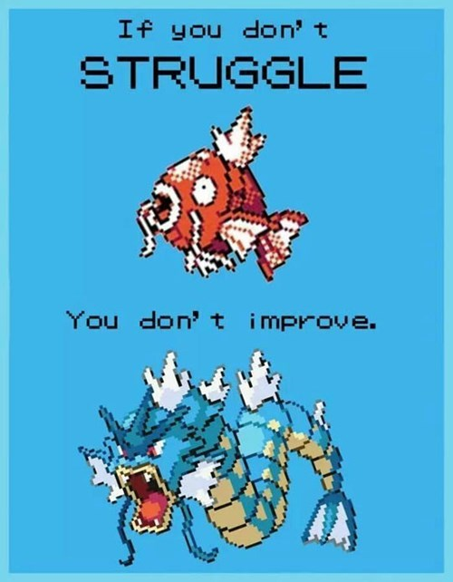

Nietzsche speaks with a reckless contempt that reminds me of Taleb; I wonder how much Taleb was encouraged by Nietzsche, and when.

I like the Translator's Preface by Kaufmann because it sheds some light on the failings of the translators that came before &mdash; mainly, neither of the two previous translators had been philosophers.

## On the Prejudices of Philosophers

Nietzsche demonstrates tremendous understanding of the history of philosophy, and of the weaknesses of the most popular philosophies that have come before. But the first thing Nietzsche does is challenge the "will to truth", not so much its desirability but its identity. What if the truth that we have been willing ourselves towards for so many generations, what if the all of the philosophic labor spent on these questions has not been advancing us towards Truth at all?

> The will to truth which will still tempt us to many a venture, that famous truthfulness of which all philosophers so far have spoken with respect &mdash; what questions has this will to truth not laid before us! What strange, wicked, questionable questions! That is a long story even now &mdash; and yet it seems as if it had scarcely begun. Is it any wonder that we should finally become suspicious, lose patience, and turn away impatiently? that we should finally learn from this Sphinx to ask questions, too? _Who_ is it really that puts questions to us here? _What_ in us really wants "truth"?
>
> &mdash; p. 9, section 1

He characterizes our will to truth as a Sphinx that poses us, not idle or benign, but compelling and _wicked_ questions that _still tempt us to many a venture_. What is good? Do I matter? Why am I here? For thousands of years we grappled with the questions this Sphinx posed us, never stopping to question the Sphinx and its motives and misunderstandings, never stopping to ask who the Sphinx really is and what it really wants of us.

Philosophers used to be charged with codifying Universal Truth, and now they're just mouthpieces for the Lizard-Man Survival Warlord; the questions they think relevant to investigate were selected by evolutionary pressure to sustain the particular creature we are and in no other way bear any relationship to Objective Reality as we like to imagine it; the information philosophers use to assign strength to conflicting arguments is defined by this same evolutionary selection pressure and thus holds the same tenuous relationship with Objective Reality.

Calls basically everyone a propagandist:

> They [philosophers] all pose as if they had discovered and reached their real opinions through the self-development of a cold, pure, divinely unconcerned dialectic (as opposed to the mystics of every rank, who are more honest and doltish &mdash; and talk of "inspiration"); while at bottom it is an assumption, a hunch, indeed a kind of "inspiration" &mdash; most often a desire of the heart that has been filtered and made abstract &mdash; that they defend with reasons they have sought after the fact.
>
> &mdash; p. 12, section 5

Nietzsche consistently makes his arguments from genealogical grounds, claiming that the "will to truth" or the "drive to knowledge" or whatever previous generations of philosophers called this phenomenon was not actually paramount in the human spirit.

> I do not believe that a "drive to knowledge" is the father of philosophy; but rather that another drive has, here as elsewhere, employed understanding (and misunderstanding) as a mere instrument.
>
> &mdash; p. 13, section 6

## The Free Spirit

> There is no other way: the feelings of devotion, self-sacrifice for one's neighbor, the whole morality of self-denial must be questioned mercilessly and taken to court... There is too much charm and sugar in these feelings of "for others," "_not_ for myself," for us not to need to become doubly suspicious at this point and to ask: "are these not perhaps&mdash;_seductions?_"
>
> That they _please_&mdash;those who have them and those who enjoy their fruits, and also the mere spectator&mdash;this does not yet constitute an argument in their _favor_ but rather invites caution. So let us be cautious.
>
> &mdash; p. 45, section 33

If doing good feels good, how do you know you're really doing good and not just doing what makes you feel good?

> In all the countries of Europe, and in America, too, there now is something that abuses this name [free spirit]: a very narrow, imprisoned, chained type of spirits who want just about the opposite of what accords with our intentions and instincts... What they would like to strive for with all their powers is the universal green-pasture happiness of the herd, with security, lack of danger, comfort, and an easier life for everyone; the two songs and doctrines which they repeat most often are "equality of rights" and "sympathy for all that suffers"&mdash;and suffering itself they take for something that must be _abolished_.
>
> We opposite men, having opened our eyes and conscience to the question where and how the plant "man" has so far grown most vigorously to a height&mdash;we think that this has happened every time under the opposite conditions...
>
> &mdash; p. 54, section 44

## What Is Religious

> How is the denial of the will _possible?_ how is the saint possible?
>
> &mdash; p. 61, section 47

> So far the most powerful human beings have still bowed worshipfully before the saint as the riddle of self-conquest and deliberate final renunciation. Why did they bow? In him&mdash;and as it were behind the question mark of his fragile and miserable appearance&mdash;they sensed the superior force that sought to test itself in such a conquest, the strength of the will in which they recognized and honored their own strength and delight in dominion: they honored something in themselves when they honored the saint. ...the powerful of the world learned a new fear before him; they sensed a new power, a strange, as yet unconquered enemy&mdash;it was the "will to power" that made them stop before the saint. They had to ask him&mdash;
>
> &mdash; p. 65, section 51

## Epigrams and Interludes

> Once the decision has been made, close your ear even to the best counterargument: sign of a strong character. Thus an occasional will to stupidity.
>
> &mdash; p. 84, section 107

-   Weird Al's _Dare to be Stupid_
-   Littlefinger quote

> One seeks a midwife for his thoughts...
>
> &mdash; p. 88, section 136

## Natural History of Morals

> Just because our moral philosophers knew the facts of morality only very approximately in arbitrary extracts or in accidental epitomes&mdash;for example, as the morality of their environment, their class, their church, the spirit of their time, their climate and part of the world&mdash;just because they were poorly informed and not even very curious about different peoples, times, and past ages&mdash;they never laid eyes on the real problems of morality; for these emerge only when we compare _many_ moralities. ... What the philosophers called a "rational foundation for morality" and tried to supply was, seen in the right light, merely a scholarly variation of the common _faith_ in the prevalent morality; a new means of _expression_ for this faith; and thus just another fact within a particular morality; indeed, in the last analysis a kind of denial that this morality might ever be considered problematic&mdash;certainly the very opposite of an examination, analysis, questioning, and vivisection of this very faith.
>
> pp. 97-98, section 186

## We Scholars

> ... skepticism is the most spiritual expression of a certain complex physiological condition that in ordinary language is called nervous exhaustion and sickliness... But what becomes sickest and degenerates most in such hybrids [skeptics] is the _will_: they no longer know independence of decisions and the intrepid sense of pleasure in willing&mdash;they doubt the "freedom of the will" even in their dreams.
>
> &mdash; p. 130, section 208

> He [Frederick the Great] saw his son surrender to atheism, to _esprit_, to the hedonistic frivolity of clever Frenchmen: in the background he saw that great vampire, the spider of skepticism; he suspected the incurable misery of a heart that no longer commands, no longer is capable of commanding.
>
> &mdash; p. 132, section 209

> ... precisely when they [artists] no longer do anything "voluntarily" but do everything of necessity, their feeling of freedom, subtlety, full power, of creative placing, disposing, and forming reaches its peak&mdash;in short, that necessity and "freedom of the will" then become one in them.
>
> &mdash; p. 140, section 213

## Our Virtues

> ... one should not be too right if one wants to have those who laugh on one's side; a grain of wrong actually belongs to good taste.
>
> &mdash; p. 149, section 221

> You want, if possible&mdash;and there is no more insane "if possible"&mdash;_to abolish suffering_. And we? It really seems that _we_ would rather have it higher and worse than ever. Well-being as you understand it&mdash;that is no goal, that seems to us an _end_, a state that soon makes man ridiculous and contemptible&mdash;that makes his destruction _desirable_.
>
> The discipline of suffering, of _great_ suffering&mdash;do you not know that only _this_ discipline has created all enhancements of man so far? That tension of the soul in unhappiness which cultivates its strength, its shudders face to face with great ruin, its inventiveness and courage in enduring, persevering, interpreting, and exploiting suffering, and whatever has been granted to it of profundity, secret, mask, spirit, cunning, greatness&mdash;was it not granted to it through suffering, through the discipline of great suffering? In man _creature_ and _creator_ are united: in man there is material, fragment, excess, clay, dirt, nonsense, chaos; but in man there is also creator, formgiver, hammer hardness, spectator divinity, and seventh day: do you understand this contrast? And that _your_ pity is for the "creature in man," for what must be formed, broken, forged, torn, burnt, made incandescent, and purified&mdash;that which _necessarily_ must and _should_ suffer? And _our_ pity&mdash;do you not comprehend for whom our _converse_ pity is when it resists your pity as the worst of all pamperings and weaknesses?
>
> &mdash; pp. 153-154, section 225

## Peoples and Fatherlands

Nietzsche calls Darwin a "respectable but mediocre Englishman."

## What is Noble

> Refraining mutually from injury, violence, and exploitation and placing one's will on a par with that of someone else&mdash;this may become, in a certain sense, good manners among individuals if the appropriate conditions are present (namely, if these men are actually similar in strength and value standards and belong together in _one_ body). But as soon as this principle is extended, and possibly even accepted as the _fundamental principle of society_, it immediately proves to be what it really is&mdash;a will to the _denial_ of life, a principle of disintegration and decay.
>
> Here we must beware of superificiality and get to the bottom of the matter, resisting all sentimental weakness: life itself is _essentially_ appropriation, injury, overpowering of what is alien and weaker; suppression, hardness, imposition of one's own forms, incorporation and at least, at its mildest, exploitation&mdash;but why should one always use those words in which a slanderous intent has been imprinted for ages?
>
> ... everywhere people are now raving, even under scientific disguises, about coming conditions of society in which "the exploitative aspect" will be removed&mdash;which sounds to me as if they promised to invent a way of life that would dispense with all organic functions. "Exploitation" does not belong to a corrupt or imperfect and primitive society: it belongs to the _essence_ of what lives, as a basic organic function; it is a consequence of the will to power, which is after all the will of life.
>
> &mdash; p. 203, section 259

> There are _master morality_ and _slave morality_&mdash;I add immediately that in all the higher and more mixed cultures there also appear attempts at mediation between these two moralities, and yet more often the interpenetration and mutual misunderstanding of both, and at times they occur directly alongside each other&mdash;even in the same human being, within a _single_ soul.
>
> &mdash; p. 204, section 260

> Every philosophy is a foreground philosophy&mdash;that is a hermit's judgment: "There is something arbitrary in his stopping _here_ to look back and around, in his not digging deeper _here_ but laying his spade aside; there is also something suspicious about it." Every philosophy also _conceals_ a philosophy; every opinion is also a hideout, every word also a mask.
>
> &mdash; p. 229, section 289
